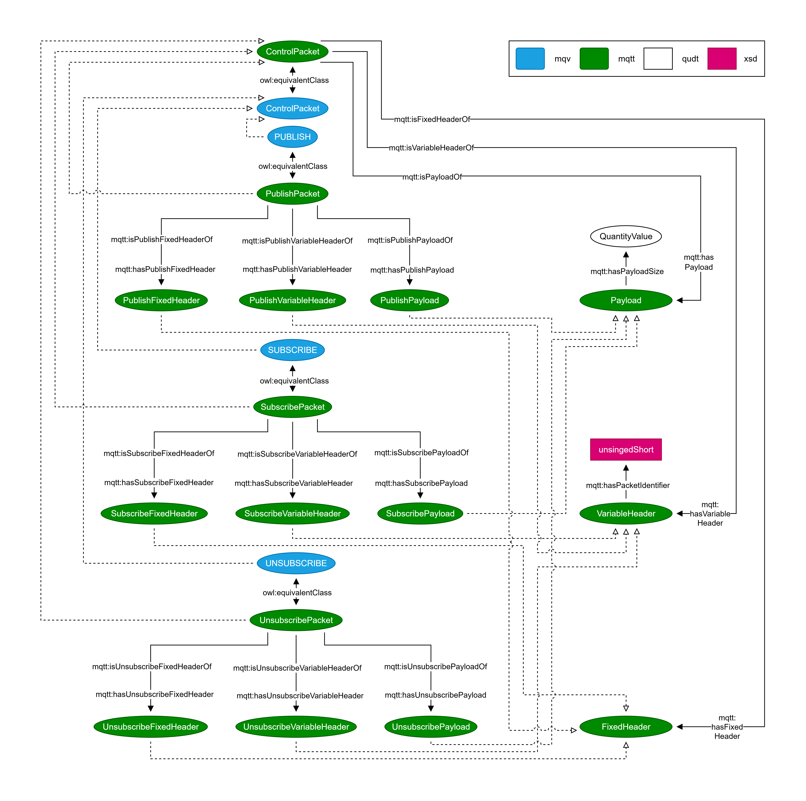
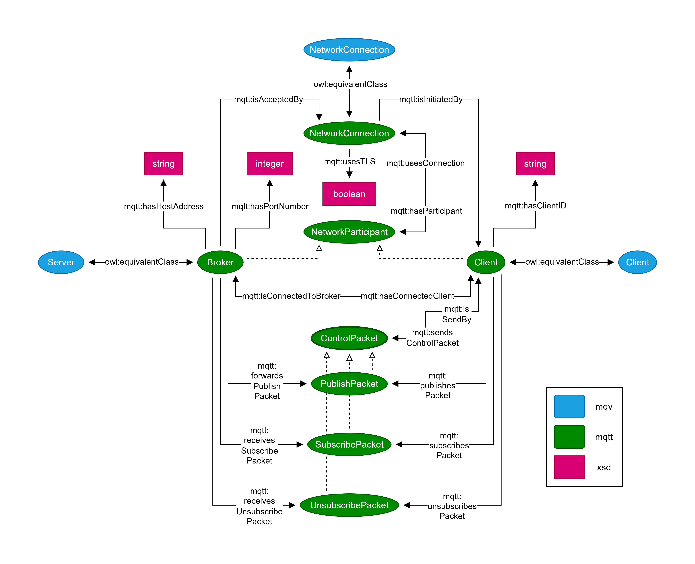
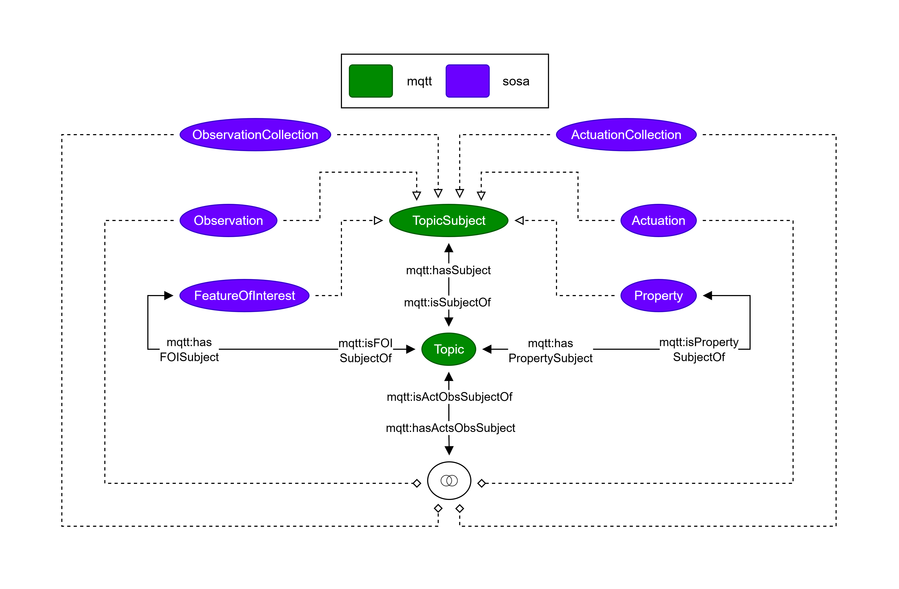

# MQTT4SSN Ontology

   

MQTT4SSN is an ontology representing the MQTT transport protocol, containing the transmitted data. It extends the W3C SSN/SOSA ontology with the MQTT transport protocol component and uses the WoT MQTT to RDF draft as an ontology design pattern.

## Key Features

The ontology captures the essential elements of MQTT, such as the network entities broker and client, the various control packets and their payloads, the topics that organize communication, and the interrelations between these components. The ontology covers the following key features:

* Supports main MQTT control packets: PUBLISH, SUBSCRUBE and UNSUBSCRIBE
* Enables representation of heterogeneous payload formats and character encodings
* Alignment with the well-established W3C SSN/SOSA ontology
* Models the relation between MQTT topic naming and SOSA elements such as FeatureOfInterest, Property, Actuation, ActuationCollection, Observation, and ObservationCollection

## Visualization

## How to cite
Please cite the MQTT4SSN ontology as follows:

Niklas Doerner, Maria Maleshkova (2025): MQTT4SSN Ontology. https://doi.org/10.5281/zenodo.16704302

 

## License
All resources are licensed under Creative Commons Attribution-NonCommercial-ShareAlike 4.0 International.

